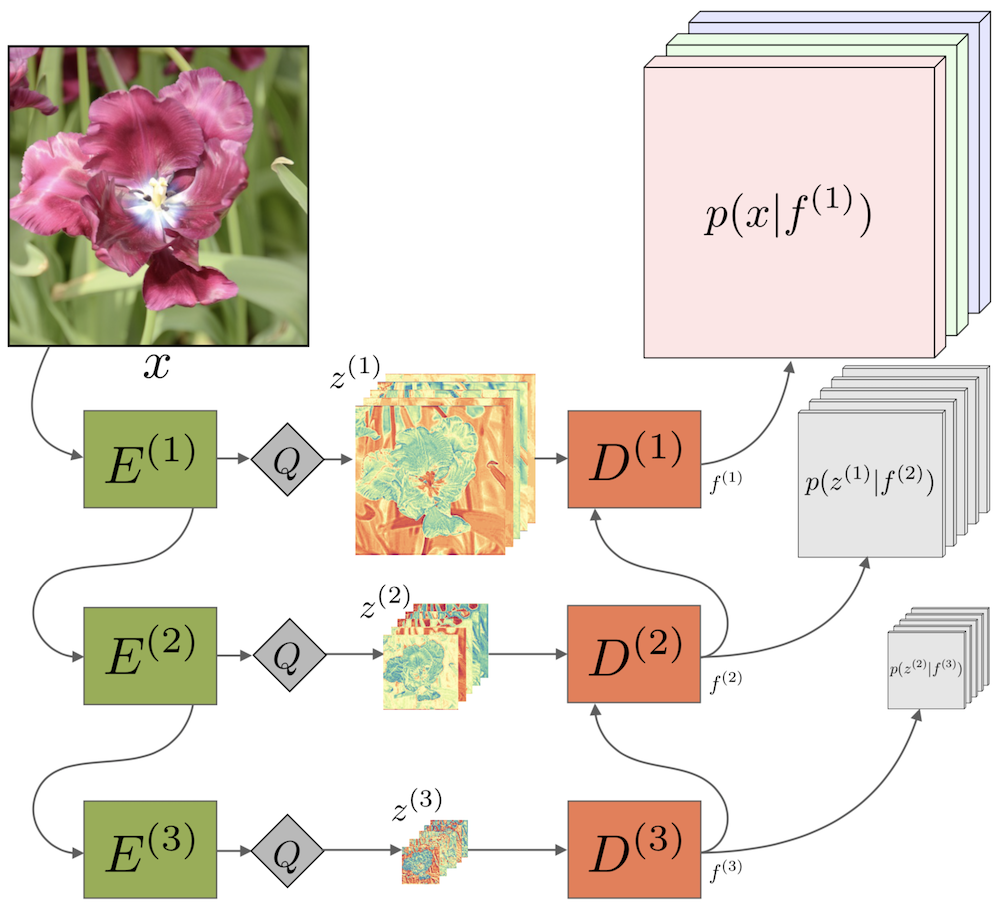
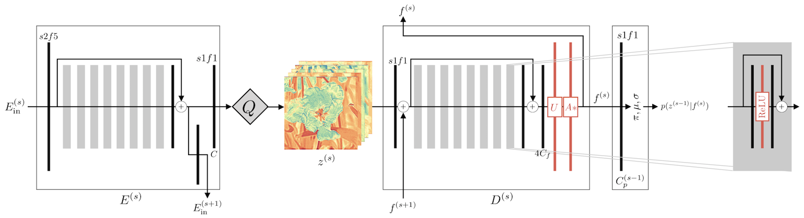
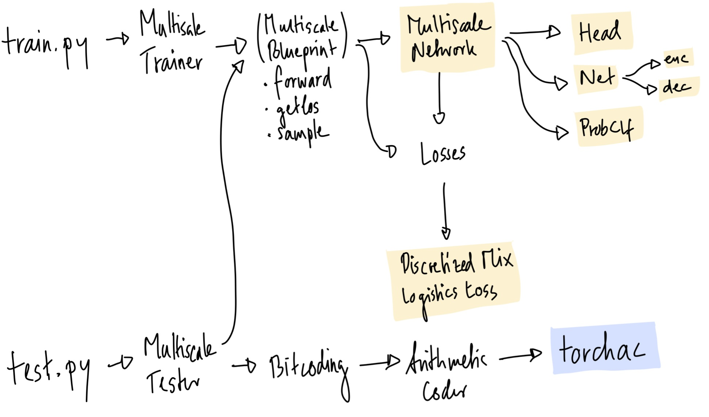

# Practical Full Resolution Learned Lossless Image Compression


### Fabian Mentzer, Eirikur Agustsson, Michael Tschannen, Radu Timofte, Luc Van Gool
ETH Zurich

_CVPR'19 (oral presentation)_

<div align="center">
  
</div>


## [[Paper]](https://arxiv.org/abs/1811.12817) [[Citation]](#citation) [[Oral]](#oral) [[Poster]](#poster) [[FAQ]](#faq)

### Abstract

We propose the first practical learned lossless image compression system, L3C, and show that it outperforms the
popular engineered codecs, PNG, WebP and JPEG 2000.
At the core of our method is a fully parallelizable hierarchical probabilistic model for adaptive entropy coding which is optimized end-to-end for the compression task.
In contrast to recent autoregressive discrete probabilistic models such as PixelCNN, our method i) models the image distribution jointly with learned auxiliary representations instead of exclusively modeling the image distribution in RGB space, and ii) only requires three forward-passes to predict all pixel probabilities instead of one for each pixel.
As a result, L3C obtains over two orders of magnitude speedups when sampling compared to the fastest PixelCNN variant (Multiscale-PixelCNN).
Furthermore, we find that learning the auxiliary representation is crucial and outperforms predefined auxiliary representations such as an RGB pyramid significantly.


## Version 3

This is an updated version of the repo. See issue [#14](https://github.com/fab-jul/L3C-PyTorch/issues/14) for details.


## Prerequisites for Code

Clone the repo and create a conda environment as follows:

```
conda create --name l3c_env python=3.7 pip --yes
conda activate l3c_env
```

We need PyTorch 1.1, CUDA, and some PIP packages (If you don't have a GPU, remove `cudatoolkit=10.0`):

```
conda install pytorch=1.1 torchvision cudatoolkit=10.0 -c pytorch
pip install -r pip_requirements.txt
```

To test our entropy coding, **you must also install torchac**, as [described below](#the-torchac-module-fast-entropy-coding-in-pytorch).

##### Notes
- We tested this code with Python 3.7 and PyTorch 1.1. PyTorch 1.2 is _not supported_, but progress is tracked in [#5](https://github.com/fab-jul/L3C-PyTorch/issues/5).
- The training code also works with PyTorch 0.4, but for testing, we use the `torchac` module, which
needs PyTorch 1.0 or newer to build, [see below](#the-torchac-module-fast-entropy-coding-in-pytorch).
- The code relies on `tensorboardX==1.2`, even though TensorBoard is now part of PyTorch (since 1.1)

## Released Models

We release the following trained models:


|     | Name | Training Set | ID  | Download Model |
| --- | ---- | ------------ | --- | --------- |
| Main Model | L3C | [Open Images](#prepare-open-images-for-training) | `0306_0001` | [L3C.tar.gz](http://data.vision.ee.ethz.ch/mentzerf/l3c_models_v3/L3C.tar.gz) |
| Baseline | RGB Shared | Open Images | `0306_0002` | [RGB_Shared.tar.gz](http://data.vision.ee.ethz.ch/mentzerf/l3c_models_v3/RGB_Shared.tar.gz) |
| Baseline | RGB | Open Images | `0306_0003` | [RGB.tar.gz](http://data.vision.ee.ethz.ch/mentzerf/l3c_models_v3/RGB.tar.gz) |
| Main Model | L3C | [ImageNet32](http://image-net.org/download-images)    | `0524_0004` | [L3C_inet32.tar.gz](http://data.vision.ee.ethz.ch/mentzerf/l3c_models/L3C_inet32.tar.gz) |
| Main Model | L3C | [ImageNet64](http://image-net.org/download-images)    | `0524_0005` | [L3C_inet64.tar.gz](http://data.vision.ee.ethz.ch/mentzerf/l3c_models/L3C_inet64.tar.gz) |

See [Evaluation of Models](#evaluation-of-models) to learn how to evaluate on a dataset.

### Training

To train a model yourself, 
you have to first prepare the data as shown in [Prepare Open Images Train](#prepare-open-images-for-training).
Then, use one of the following commands, [explained in more detail below](#experiments):

| Model | Train with the following flags to `train.py`|
| --- | --- |
| L3C               | `configs/ms/cr.cf configs/dl/oi.cf log_dir` |
| RGB Shared        | `configs/ms/cr_rgb_shared.cf configs/dl/oi.cf log_dir` |
| RGB               | `configs/ms/cr_rgb.cf configs/dl/oi.cf log_dir` |
| L3C ImageNet32    | `configs/ms/cr.cf configs/dl/in32.cf -p lr.schedule=exp_0.75_e1 log_dir` |
| L3C ImageNet64    | `configs/ms/cr.cf configs/dl/in64.cf -p lr.schedule=exp_0.75_e1 log_dir` |

Each of the released models were trained for around 5 days on a Titan Xp.

*Note*: We do not provide code for multi-GPU training. To incorporate `nn.DataParallel`, the code must be changed
slightly: In `net.py`, `EncOut` and `DecOut` are `namedtuple`s, which is not supported by `nn.DataParallel`.

### Evaluation

To test an [experiment](#experiments), use `test.py`. For example, to test L3C and the baselines, run

```
python test.py /path/to/logdir 0306_0001,0306_0002,0306_0003 /some/imgdir,/some/other/imgdir \
    --names "L3C,RGB Shared,RGB" --recursive=auto
```

For this, you need to download the models to some directory, in the example this is `/path/to/logdir`.

To use the entropy coder and get timings for encoding/decoding, use `--write_to_files` (this needs `torchac`, 
[see below](#the-torchac-module-fast-entropy-coding-in-pytorch). If you did not compile `torchac` with CUDA support,
disable CUDA by running `CUDA_VISIBLE_DEVICES="" python test.py ...`):

```
python test.py /path/to/logdir 0306_0001 /some/imgdir --write_to_files=files_out_dir
```

More flags available with `python test.py -h`.

#### Evaluation on Open Images

We evaluated our model on 500 images randomly selected from the Open Images validation set, and preprocessed like the 
training data. To compare, please 
[download Open Images evaluation set here](http://data.vision.ee.ethz.ch/mentzerf/validation_sets_lossless/val_oi_500_r.tar.gz).

#### Adaptive Cropping

The evaluation code automatically split images that are too big into non-overlapping crops. By default,
the threshold is set to images bigger than `2000 * 1500` pixels in total. This can be overwritten by 
setting `AC_NEEDS_CROP_DIM` from the console, e.g.,

```
AC_NEEDS_CROP_DIM=2000,2000 python test.py ...
```

See `auto_crop.py` for details.


<!--
### Results

When preparing this repo, we found that removing one approximation in the loss originally introduced by the PixelCNN++
 code slightly improved the final bitrates of L3C, while performance of the baselines got slightly worse.


The code contains the loss without the approximation.
We note that [arXiv v2](https://arxiv.org/abs/1811.12817v2) is the same as CVPR Camera Ready version, and the results in there where obtained
with the approximation.

However, if you re-train with the provided code, you'll get the new results.
For clarity, we compare the new results as obtained by the **released code**, with the results in the **Camera Ready**:

| Model | Released [bpsp OI] | Camera Ready [bpsp OI] |
| ----- | ------------- | ----------------- |
| L3C   | 2.578         | 2.604 |
| RGB Shared | 2.948    | 2.918 |
| RGB   | 2.832         | 2.819 |

Here, _bpsp OI_ means bit per sub-pixel on Open Images Test.

We did not re-train the ImageNet32 and ImageNet64 models.
-->

## Oral

### [[Oral on Youtube]](https://youtu.be/PzALQZOy09c?t=63) [[Download Oral Slides]](http://data.vision.ee.ethz.ch/mentzerf/l3c_pdfs/l3c_oral_slides.pdf)

## Poster

### [[Download Poster PDF]](http://data.vision.ee.ethz.ch/mentzerf/l3c_pdfs/l3c_poster.pdf)

## FAQ

During the CVPR Poster session, the following where the most frequently asked questions:

#### How can I learn a _lossless_ model with CNNs?

First of all, to do lossless compression, you just need to know a probability distribution over your symbols. This is visualized in the bottom left of the poster. Given such a distribution, you can do entropy coding, for example [Huffman Coding](https://en.wikipedia.org/wiki/Huffman_coding).

For natural images, we use the pixels of an image as the stream of symbols. Because they are not independent, we model the joint `p tilde (x_1, ..., x_N)` (see bottom left of poster). 

Now, what Fig. 1 in the paper and the figure in the middle of the poster show is how we learn this p tilde. **The important thing to realize** is that the output of our model is p tilde, _it is not a quantized autoencoder_. Given this p tilde, we can do entropy coding. It doesn't matter that we have quantization in the network: no matter how bad p tilde is,
you can always do lossless compression -- you might just use a lot of bits!

Note that the model we learn (shown in Fig. 1), is used to get p tilde. We then use this to do entropy coding, as visualized on the top right of the poster or Fig. A4 in the paper.

#### What does Adapative Arithmetic Coding mean?

I'll explain this via [Huffman coding](https://en.wikipedia.org/wiki/Huffman_coding), as more people are familiar with that. In the default lossless compression case, we assume the symbols in our stream ("message") are all independent and identically distributed (i.i.d) according to p. We create one Huffman table for all symbols. Consider now the fruit in the bottom left of the poster. Imagine that they are not independent, but that e.g. apples are more likely to appear after bananas. In these cases, it makes sense to have different Huffman tables for different positions in the stream. We would call that "adaptive" Huffman coding. The table at some point in the stream would depend on the _conditional distribution of that symbol_.

Adaptive Arithmetic coding is the same thing, except that we generalize [Arithmetic coding](https://en.wikipedia.org/wiki/Arithmetic_coding) to the non-i.i.d. case.

This is also described in the Paper, in Section 3.1.

#### Other questions?

Feel free to write an email to us (E-Mail in paper) or open an issue here.


## Details about Code

### Experiments

Whenever `train.py` is executed, a new _experiment_ is started.
Every experiment is based on a specific configuration file for the network, stored in _configs/ms_ and
another file for the dataloading, stored in _configs/dl_.
An experiment is uniquely identified by the **log date**, which is just date and time (e.g. `0506_1107`).
The config files are parsed with the [parser from `fjcommon`](https://github.com/fab-jul/fjcommon#configparserpy),
which allows hiararchies of configs.
Additionally, there is `global_config.py`, to allow quick changes by passing
 additional parameters via the `-p` flag, which are then available _everywhere_ in the code, see below.
 The config files plus the `global_config` flags specify _all_ parameters needed to train a network. 

When an experiment is started, a directory with all this information is created in the folder passed as
`LOG_DIR_ROOT` to `train.py` (see `python train.py -h`).

For example, running

```bash
python train.py configs/ms/cr.cf configs/dl/oi.cf log_dir -p upsampling=deconv
```

results in a folder `log_dir`, and in there another folder called

```
0502_1213 cr oi upsampling=deconv
```

Checkpoints (weights) will be stored in a subfolder called `ckpts`.

This experiment can then be evaluated simply by passing the log date to `test.py`, in addition to some image folders:


```bash
python test.py logs 0502_1213 data/openimages_test,data/raise1k
```

where we test on images in `data/openimages_test` and `data/raise1k`.

To use another model as a **pretrained model**, use `--restore` and `--restore_restart`:

```bash
python train.py configs/ll/cr.cf configs/dl/oi.cf logs --restore 0502_1213 --restore_restart
```

### Naming of Code vs. Paper

<div align="center">
  
</div>


| Name in Paper | Symbol | Name in Code | Short | Class |
| ----- | -------| -----| ----- | -----|
| Feature Extractor | `E` | Encoder | `enc` | `EDSRLikeEnc`
| Predictor | `D` | Decoder | `dec` | `EDSRLikeDec`
| Quantizer | `Q` | Quantizer | `q` | `Quantizer`
| Final box, outputting pi, mu, sigma |  | Probability Classifier | `prob_clf` | `AtrousProbabilityClassifier`

See also the notes in `src/multiscale_network/multiscale.py`.

### Structure of the Code

The code is quite modular, as it was used to experiment with different things. At the heart is the
`MultiscaleBlueprint` class, which has the following main functions: `forward`, `get_loss`, `sample`. It is used by the
`MultiscaleTrainer` and `MultiscaleTester`. The network is created by `MultiscaleNetwork`, which pulls together all
the PyTorch modules needed. The discretized mixture of logistics loss is in `DiscretizedMixLogisticsLoss`, which is
usally referred to as `dmll` or `dmol` in the code.

For bitcoding, there is the `Bitcoding` class, which uses the `ArithmeticCoding` class, which in turn uses my
`torchac` module, written in C++, and described below.

<div align="center">
  
</div>

## The `torchac` Module: Fast Entropy Coding in PyTorch

We implemented an entropy coding module as a C++ extension for PyTorch, because no existing fast Python entropy
 coding module was available. You'll need to build it if you plan to use the `--write_to_file` flag for `test.py`
 ([see Evaluation of Models](#evaluation-of-models)).

The implementation is based on [this blog post](https://marknelson.us/posts/2014/10/19/data-compression-with-arithmetic-coding.html),
meaning that we implement _arithmetic coding_.
It is **not optimized**, however, it's much faster than doing the equivalent thing in pure-Python (because of all the
 bit-shift etc.). Encoding an entire `512 x 512` image happens in 0.202s (see Appendix A in the paper).

A good starting point for optimizing the code would probably be the [`range_coder.cc`](https://github.com/tensorflow/compression/blob/master/tensorflow_compression/cc/kernels/range_coder.cc)
implementation of
[TFC](https://tensorflow.github.io/compression/).


#### GPU and CPU support

The module can be built with or without CUDA. The only difference between the CUDA and non-CUDA versions is:
With CUDA, `_get_uint16_cdf` from `torchac.py` is done with a simple/non-optimized CUDA kernel (`torchac_kernel.cu`),
which has one benefit: we can directly write into shared memory! This saves an expensive copying step from GPU to CPU.

However, compiling with CUDA is probably a hassle. We tested with
- GCC 5.5 and NVCC 9.0
- GCC 7.4 and NVCC 10.1 (update 2)
- _Did not work_: GCC 6.0 and NVCC 9
Please comment if you have insights into which other configurations work (or don't.)

The main part (arithmetic coding), is always on CPU.

#### Compiling

_Step 1_: Make sure a **recent `gcc` is available** in `$PATH` by running `gcc --version` (tested with version 5.5).
If you want CUDA support, make sure `nvcc -V` gives the desired version (tested with nvcc version 9.0).

_Step 1b, macOS only_ (tested with 10.14): Set the following
```bash
export CC="clang++ -std=libc++"
export MACOSX_DEPLOYMENT_TARGET=10.14
```

_Step 2_:
 ```bash
 conda activate l3c_env
 cd src/torchac
 COMPILE_CUDA=auto python setup.py install
 ```
- `COMPILE_CUDA=auto`: Use CUDA if a `gcc` between 5 and 6, and `nvcc` 9 is avaiable
- `COMPILE_CUDA=force`: Use CUDA, don't check `gcc` or `nvcc`
- `COMPILE_CUDA=no`: Don't use CUDA

This installs a package called `torchac-backend-cpu` or `torchac-backend-gpu` in your `pip`. 
Both can be installed simultaneously. See also next subsection.

_Step 3_: To test if it works, you can do
  ```
 conda activate l3c_env
 cd src/torchac
 python -c "import torchac"
 ```
It should not print any error messages.


#### Selecting torchac: `torchac-backend-cpu` vs `torchac-backend-gpu` 

Installing `torchac-backend-cpu` is easiest. However, if a GPU is available in the system, `torchac-backend-gpu` will be faster.

If you use `l3c.py`, it will automatically select whether the 
code should run on GPU or CPU depending on whether `torchac-backend-gpu` is available. The behavior of this can be 
tuned with the `--device` flag to `l3c.py`, e.g., `python l3c.py --device=cpu enc ...`, see `python l3c.py --help`.

If you use `test.py` with the `--write_to_files` flag, a check will be performed an exception will be thrown, if the wrong 
combination of _CUDA available_ and _installed `torchac`_ exists. If you just have `torchac-backend-cpu` but a GPU in the system,
disable it via `CUDA_VISIBLE_DEVICES="" python test.py ...`.


## Sampling

To sample from L3C, use `test.py` with `--sample`:

```bash
python test.py /path/to/logdir 0306_0001 /some/imgdir --sample=samples
```

This produces outputs in a directory `samples`. Per image, you'll get something like

```bash
# Ground Truth
0_IMGNAME_3.549_gt.png
# Sampling from RGB scale, resulting bitcost 1.013bpsp
0_IMGNAME_rgb_1.013.png
# Sampling from RGB scale and z1, resulting bitcost 0.342bpsp
0_IMGNAME_rgb+bn0_0.342.png
# Sampling from RGB scale and z1 and z2, resulting bitcost 0.121bpsp
0_IMGNAME_rgb+bn0+bn1_0.121.png
```

See Section 5.4. ("Sampling Representations") in the paper.


## Using L3C to Compress Images

To encode/decode a single image, use `l3c.py`. This requires `torchac`:

```bash
# Encode to out.l3c
python l3c.py /path/to/logdir 0306_0001 enc /path/to/img out.l3c
# Decode from out.l3c, save to decoded.png
python l3c.py /path/to/logdir 0306_0001 dec out.l3c decoded.png
```

## Prepare Open Images for Training

Use the `prep_openimages.sh` script. Run it in an environment with
Python 3,
`skimage` (`pip install scikit-image`, tested with version 0.13.1), and 
[`awscli`](https://aws.amazon.com/cli/) (`pip install awscli`):
```bash
cd src
./prep_openimages.sh <DATA_DIR>
```
**NOTE**: The preprocessing may take a long time. We run it over our internal CPU cluster. Please see 
`import_train_images.py` for tips on how to incorporate your own cluster.

This will download all images to `DATA_DIR`. Make sure there is enough space there, as **this script will create 
around 300 GB of data**. Also, it will probably run for a few hours.

After `./prep_openimages.sh` is done, training data is in `DATA_DIR/train_oi` and `DATA_DIR/val_oi`. Follow the 
instructions printed by `./prep_openimages.sh` to update the config file. You may `rm -rf DATA_DIR/download` and 
`rm -rf DATA_DIR/imported` to free up some space.

(Optional) It helps to have one fixed validation image to monitor training. You may put any image at

<!--
### Option 2: Step by Step

1. Download [Open Images training sets and validation set](https://github.com/cvdfoundation/open-images-dataset#download-images-with-bounding-boxes-annotations),
we used the parts 0, 1, 2, plus the validation set:
    ```
    aws s3 --no-sign-request cp s3://open-images-dataset/tar/train_0.tar.gz train_0.tar.gz
    aws s3 --no-sign-request cp s3://open-images-dataset/tar/train_1.tar.gz train_1.tar.gz
    aws s3 --no-sign-request cp s3://open-images-dataset/tar/train_2.tar.gz train_2.tar.gz
    aws s3 --no-sign-request cp s3://open-images-dataset/tar/validation.tar.gz validation.tar.gz
    ```
1. Extract to a folder, let's say `data`. Now you should have `data/train_0`, `data/train_1`, `data/train_2`, as well
 as `data/validation`.
1. (Optional) to do the same preprocessing as in our paper, run the following. Note that it requires the `skimage`
package. To speed this up, you can distribute it on some server, by implementing a 
`task_array.sh`, see `import_train_images.py`.
    ```
    python import_train_images.py data train_0 train_1 train_2 validation
    ```
1. Put all (preprocessed) images into a train and a validation folder, let's say `data/train_oi` and
`data/validation_oi`.
1. (Optional) If you are on a slow file system, it helps to cache the contents of `data/train_oi`. Run
    ```
    cd src
    export CACHE_P="data/cache.pkl"  # <--- Change this
    export PYTHONPATH=$(pwd)
    python dataloaders/images_loader.py update data/train_oi "$CACHE_P"  --min_size 128
    ```
    The `--min_size` makes sure to skip smaller images. *NOTE*: If you skip this step, make sure no files with
    dimensions smaller than 128 are in your training foler. If they are there, training might crash.
1. Update the dataloader config, `configs/dl/oi.cf`: Set `train_imgs_glob =
'data/train_oi'` (or whatever folder you used.) If you did the previous step, set `image_cache_pkl = 'data/cache.pkl`, 
if you did not, set `image_cache_pkl = None`. Finally, update `val_glob = 'data/validation_oi'`.
1. (Optional) It helps to have one fixed validation image to monitor training. You may put any image at
`src/train/fixedimg.jpg` and it will be used for that (see `multiscale_trainer.py`).
-->

## Future Work for Code

- Add support for `nn.DataParallel`.
- Incorporate TensorBoard support from PyTorch, instead of pip package.

## Citation

If you use the work released here for your research, please cite this paper:
```
@inproceedings{mentzer2019practical,
    Author = {Mentzer, Fabian and Agustsson, Eirikur and Tschannen, Michael and Timofte, Radu and Van Gool, Luc},
    Booktitle = {Proceedings of the IEEE Conference on Computer Vision and Pattern Recognition (CVPR)},
    Title = {Practical Full Resolution Learned Lossless Image Compression},
    Year = {2019}}
```
